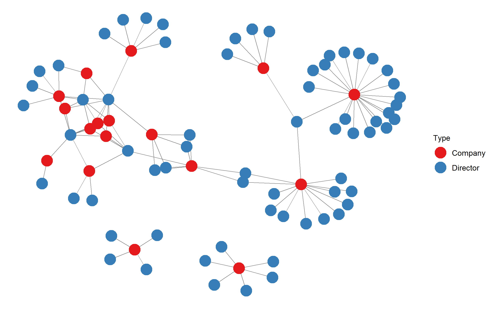
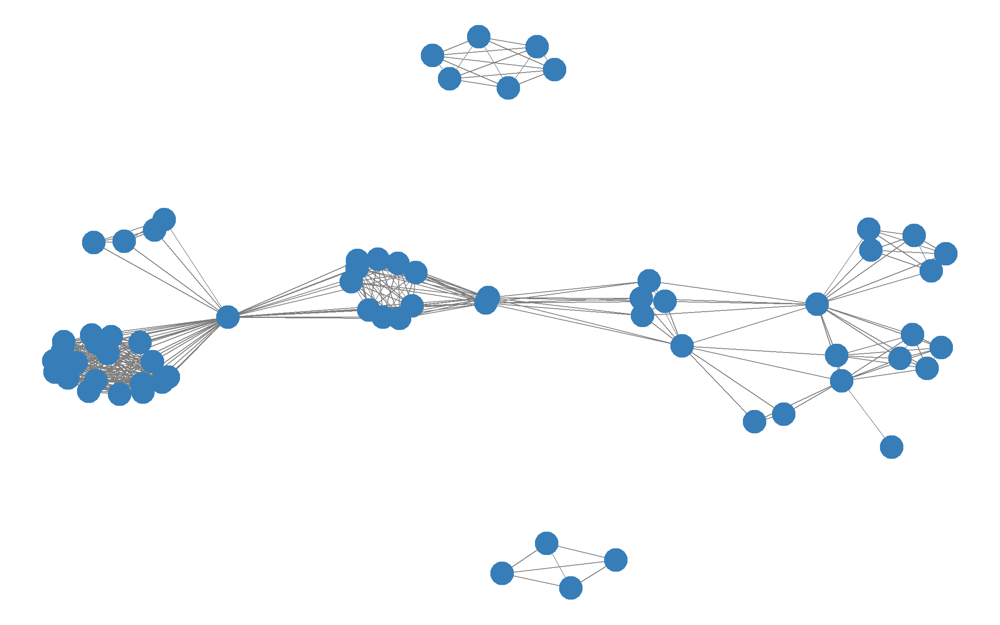
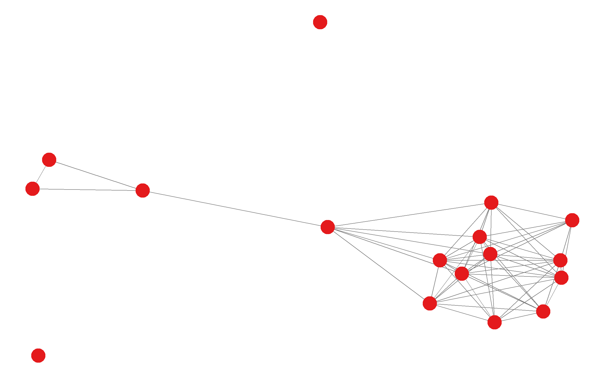
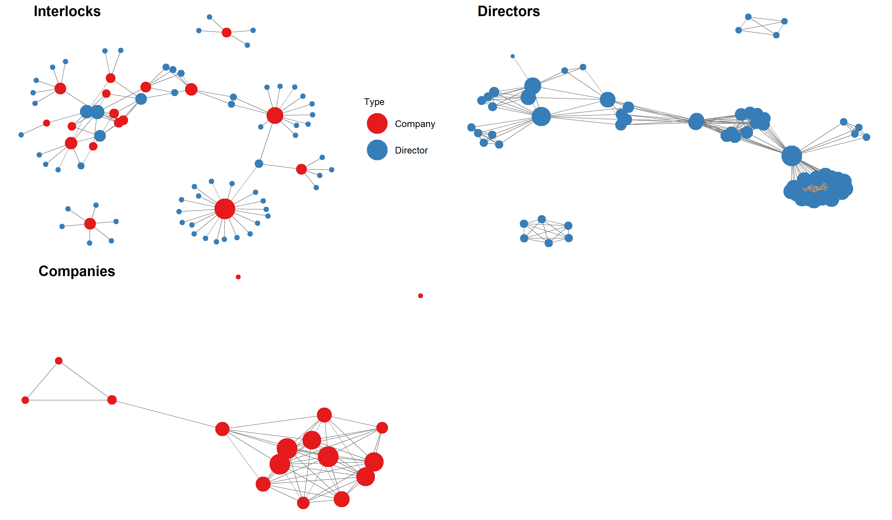

Companies House
================

This is an R package aimed at helping in extracting data from companies
house: <https://www.gov.uk/government/organisations/companies-house>

It particular, it provides a way to search for companies and extract a
set of company numbers. These company numbers can then be used to
identify company directors.

This package also provides functions which allow you to build a network
of interlocking directors, that is a network of individuals and the
companies, linked by board membership. Other networks are also created -
such as director networks, this is a set of individuals linked by
sitting on (at least one of) the same company board of directors.
Company networks - a set of companies linked by having (at least one of)
the same directors sitting on the board.

To install follow these steps

``` r
#Install CompaniesHouse:
library(devtools)
devtools::install_github("MatthewSmith430/CompaniesHouse")
library(CompaniesHouse)
```

## Authorisation Key

To extract data from companies house (with the API), you will need to
get an authorisation key.

The instructions on how to obtain your key can be found at:
<https://developer.company-information.service.gov.uk/>

When using the package, save your key as `mkey`:

``` r
mkey<-"ENTER YOUR AUTHORISATION KEY"
```

## Company Search

The following function allows you to search for companies in Companies
House (using the API). You use the search term with your authorisation
key, and it returns a list of companies that match the search term. It
also give the Companies House Company number, the company address and
various other information. The company number is important, as it is
used to identify the firm, and is used in many of the other package
functions. There are three versions for this command:  
1\. `CompanySearch_limit_first` This returns the first company from the
search results  
2\. `CompanySearch_limit` This return the first page of search results  
3\. `CompanySearch` This returns all search results

In the following example I will use `CompanySearch_limit` (yet I will
only display the first three results to save space)

``` r
#Search for a "COMPANY SEARCH TERM"
#In this example we use "unilever"

CompanySearchList<-CompanySearch_limit("unilever",mkey)
```

<table>

<thead>

<tr>

<th style="text-align:left;">

id.search.term

</th>

<th style="text-align:left;">

company.name

</th>

<th style="text-align:left;">

company.number

</th>

<th style="text-align:left;">

Date.of.Creation

</th>

<th style="text-align:left;">

company.type

</th>

<th style="text-align:left;">

company.status

</th>

<th style="text-align:left;">

address

</th>

<th style="text-align:left;">

Locality

</th>

<th style="text-align:left;">

postcode

</th>

</tr>

</thead>

<tbody>

<tr>

<td style="text-align:left;">

unilever

</td>

<td style="text-align:left;">

UNILEVER PLC

</td>

<td style="text-align:left;">

00041424

</td>

<td style="text-align:left;">

1894-06-21

</td>

<td style="text-align:left;">

plc

</td>

<td style="text-align:left;">

active

</td>

<td style="text-align:left;">

Port Sunlight, Wirral, Merseyside, CH62 4ZD

</td>

<td style="text-align:left;">

Merseyside

</td>

<td style="text-align:left;">

CH62 4ZD

</td>

</tr>

<tr>

<td style="text-align:left;">

unilever

</td>

<td style="text-align:left;">

UNILEVER AUSTRALIA INVESTMENTS LIMITED

</td>

<td style="text-align:left;">

00137659

</td>

<td style="text-align:left;">

1914-09-12

</td>

<td style="text-align:left;">

ltd

</td>

<td style="text-align:left;">

active

</td>

<td style="text-align:left;">

Unilever House, 100 Victoria Embankment, London, EC4Y 0DY

</td>

<td style="text-align:left;">

London

</td>

<td style="text-align:left;">

EC4Y 0DY

</td>

</tr>

<tr>

<td style="text-align:left;">

unilever

</td>

<td style="text-align:left;">

UNILEVER AUSTRALIA PARTNERSHIP LIMITED

</td>

<td style="text-align:left;">

00315312

</td>

<td style="text-align:left;">

1936-06-17

</td>

<td style="text-align:left;">

ltd

</td>

<td style="text-align:left;">

active

</td>

<td style="text-align:left;">

Unilever House, 100 Victoria Embankment, London, EC4Y 0DY

</td>

<td style="text-align:left;">

London

</td>

<td style="text-align:left;">

EC4Y 0DY

</td>

</tr>

</tbody>

</table>

## Extract Directors Data

This function extracts director information for a company numbers. Where
it gives a dataframe containing a list of directors and director
information for the company number. In this example, I will ouput a
small selection of the directors from Unilever Plc.

``` r
#We conintue to use Uniever as a example, we know that the company
#number for Unilever Plc is "00041424".

#Therefore we can extract the director information
#for Unilvever Plc
DirectorInformation<-company_ExtractDirectorsData("00041424", mkey)
```

<table>

<thead>

<tr>

<th style="text-align:left;">

company.id

</th>

<th style="text-align:left;">

director.id

</th>

<th style="text-align:left;">

directors

</th>

<th style="text-align:left;">

start.date

</th>

<th style="text-align:left;">

end.date

</th>

<th style="text-align:left;">

occupation

</th>

<th style="text-align:left;">

role

</th>

<th style="text-align:left;">

residence

</th>

<th style="text-align:left;">

postcode

</th>

<th style="text-align:left;">

nationality

</th>

<th style="text-align:right;">

birth.year

</th>

<th style="text-align:right;">

birth.month

</th>

<th style="text-align:left;">

former.name

</th>

<th style="text-align:left;">

download.date

</th>

</tr>

</thead>

<tbody>

<tr>

<td style="text-align:left;">

00041424

</td>

<td style="text-align:left;">

i-a1nTc06VZikEBTLGW9DYwuANM

</td>

<td style="text-align:left;">

SOTAMAA, Ritva

</td>

<td style="text-align:left;">

2018-01-01

</td>

<td style="text-align:left;">

NA

</td>

<td style="text-align:left;">

NA

</td>

<td style="text-align:left;">

secretary

</td>

<td style="text-align:left;">

NA

</td>

<td style="text-align:left;">

EC4Y 0DY

</td>

<td style="text-align:left;">

NA

</td>

<td style="text-align:right;">

NA

</td>

<td style="text-align:right;">

NA

</td>

<td style="text-align:left;">

NULL

</td>

<td style="text-align:left;">

2020-10-11

</td>

</tr>

<tr>

<td style="text-align:left;">

00041424

</td>

<td style="text-align:left;">

ZI4TtLjPrlcnIckJGNlqCLV2s\_Y

</td>

<td style="text-align:left;">

ANDERSEN, Nils Smedegaard

</td>

<td style="text-align:left;">

2015-04-30

</td>

<td style="text-align:left;">

NA

</td>

<td style="text-align:left;">

None

</td>

<td style="text-align:left;">

director

</td>

<td style="text-align:left;">

Denmark

</td>

<td style="text-align:left;">

EC4 0DY

</td>

<td style="text-align:left;">

Danish

</td>

<td style="text-align:right;">

1958

</td>

<td style="text-align:right;">

7

</td>

<td style="text-align:left;">

NULL

</td>

<td style="text-align:left;">

2020-10-11

</td>

</tr>

<tr>

<td style="text-align:left;">

00041424

</td>

<td style="text-align:left;">

E3FTMwTYyFn9\_AXshohmRCws23c

</td>

<td style="text-align:left;">

CHA, Laura May Lung

</td>

<td style="text-align:left;">

2013-05-15

</td>

<td style="text-align:left;">

NA

</td>

<td style="text-align:left;">

Deputy Chairman Hsbc Asia Pacific

</td>

<td style="text-align:left;">

director

</td>

<td style="text-align:left;">

Hong Kong

</td>

<td style="text-align:left;">

EC4Y 0DY

</td>

<td style="text-align:left;">

Chinese

</td>

<td style="text-align:right;">

1949

</td>

<td style="text-align:right;">

12

</td>

<td style="text-align:left;">

NULL

</td>

<td style="text-align:left;">

2020-10-11

</td>

</tr>

</tbody>

</table>

\#\#Company Sector Code  
This function finds the sector a company operates in - where it gives
its SIC code. The function requires the company number.

``` r
#Again we use Unilever Plc as an example - using their company number
CompanySIC<-CompanySIC("00041424", mkey)

CompanySIC
```

<table>

<thead>

<tr>

<th style="text-align:left;">

x

</th>

</tr>

</thead>

<tbody>

<tr>

<td style="text-align:left;">

70100

</td>

</tr>

</tbody>

</table>

## Director Information

In `CompaniesHouse` you can also examine the boards that a director sits
on, if you have the director id. The `indiv_ExtractDirectorsData`
function returns a list of firms where the individual has served as a
member of the board.

You can also search for directors by name - in a similar way to company
searches. Where you can search by director name. Similar to the company
search there are three options:  
1\. `DirectorSearch_limit_first` This returns the first director from
the search results  
2\. `DirectorSearch_limit` This return the first page of search
results  
3\. `DirectorSearch` This returns all search results

### Example

An example of the director search function can be used for examining
Boris Johnson and the firms he has previously acted as a director.

The first steps is to use the function to identify his director id. His
date of birth is June 1964 - this information can be used to identify
the correct person and id.

``` r
##Use of make use of tidyverse package to process the dataframe
library(tidyverse)
boris_search<-DirectorSearch_limit("boris johnson",mkey) %>%
  filter(month.of.birth==6 & 
           year.of.birth==1964)
```

<table>

<thead>

<tr>

<th style="text-align:left;">

id.search.term

</th>

<th style="text-align:left;">

director.id

</th>

<th style="text-align:left;">

person.name

</th>

<th style="text-align:left;">

addess.snippet

</th>

<th style="text-align:left;">

locality

</th>

<th style="text-align:right;">

month.of.birth

</th>

<th style="text-align:right;">

year.of.birth

</th>

</tr>

</thead>

<tbody>

<tr>

<td style="text-align:left;">

boris johnson

</td>

<td style="text-align:left;">

EZWa9WI6ur100VnMhfHT6EP4twA

</td>

<td style="text-align:left;">

Alexander Boris De Pfeffel JOHNSON

</td>

<td style="text-align:left;">

13 Furlong Road, London, N7 8LS

</td>

<td style="text-align:left;">

London

</td>

<td style="text-align:right;">

6

</td>

<td style="text-align:right;">

1964

</td>

</tr>

</tbody>

</table>

Now we have his id, we can extract the list of firms where he has been a
director.

``` r
boris_info<-indiv_ExtractDirectorsData(boris_search$director.id,mkey)
```

<table>

<thead>

<tr>

<th style="text-align:left;">

company.id

</th>

<th style="text-align:left;">

comapny.name

</th>

<th style="text-align:left;">

director.id

</th>

<th style="text-align:left;">

directors

</th>

<th style="text-align:left;">

director.forename

</th>

<th style="text-align:left;">

director.surname

</th>

<th style="text-align:left;">

start.date

</th>

<th style="text-align:left;">

end.date

</th>

<th style="text-align:left;">

occupation

</th>

<th style="text-align:left;">

role

</th>

<th style="text-align:left;">

residence

</th>

<th style="text-align:left;">

postcode

</th>

<th style="text-align:left;">

nationality

</th>

<th style="text-align:right;">

birth.year

</th>

<th style="text-align:right;">

birth.month

</th>

<th style="text-align:left;">

appointment.kind

</th>

<th style="text-align:left;">

download.date

</th>

</tr>

</thead>

<tbody>

<tr>

<td style="text-align:left;">

05774105

</td>

<td style="text-align:left;">

FINLAND STATION LIMITED

</td>

<td style="text-align:left;">

EZWa9WI6ur100VnMhfHT6EP4twA

</td>

<td style="text-align:left;">

Alexander Boris De Pfeffel JOHNSON

</td>

<td style="text-align:left;">

Alexander

</td>

<td style="text-align:left;">

JOHNSON

</td>

<td style="text-align:left;">

2006-04-07

</td>

<td style="text-align:left;">

2008-05-23

</td>

<td style="text-align:left;">

Editor/Politician

</td>

<td style="text-align:left;">

director

</td>

<td style="text-align:left;">

NA

</td>

<td style="text-align:left;">

N7 8LS

</td>

<td style="text-align:left;">

British

</td>

<td style="text-align:right;">

1964

</td>

<td style="text-align:right;">

6

</td>

<td style="text-align:left;">

personal-appointment

</td>

<td style="text-align:left;">

11/10/2020 19:09:53

</td>

</tr>

</tbody>

</table>

## Networks

The package can be used to create a set of networks.  
\- Interlocking directorates network: a set of companies and
individuals, where individuals are tied to companies where they sit on
the board of directors.  
\- Director network: a set of directors, where they are linked if they
sit on the same company board.  
\- Company network: a set of companies, where they are linked if they
share a director.

### Create Networks

The following functions create the various networks. Where a list of
company numbers is required to create these networks.

#### Interlocking Directorates Network

When creating the interlock network - you need to specify the years that
you want to cover - a start year and end year There are two ways to
create the interlocking directorates network:

1.) From a list of company numbers

``` r
INTERLOCKS1<-InterlockNetwork(List.of.company.numbers,mkey)

##Example for all company numbers associated with the 
##Unilever search term for 2015 -2020 
##The first steps is to remove companbies that are no longer active from the list, then create the interlock network 
library(tidyverse)
COMP_LIST<-CompanySearchList%>%
  filter(company.status=="active")

INTERLOCKS1<-InterlockNetwork(COMP_LIST$company.number,mkey,start = 2015,end = 2020)
```

2.) From a data frame produced using the `indiv_ExtractDirectorsData`
function. This dataframe can be edited manually to use company names (or
perhaps another id system) in the network.

``` r
INTERLOCKS2<-make_interlock(DataFrame)

##Example for all company numbers associated with the 
##Unilever search term - the dataframe created with indiv_ExtractDirectorsData
INTERLOCKS2<-make_interlock(MultilpleDirectorInfo)
```

#### Company Network

The next network that can be created with the `CompaniesHouse` package
is the company network. This is a one-mode projection of th interlocking
directorates network. It is a set of companies that are linked when they
share a director.

``` r
CompanyNET<-CompanyNetwork(List.of.company.numbers,mkey,start = 2015,end = 2020)

##Example for all company numbers associated with the 
##Unilever search term:
CompanyNET<-CompanyNetwork(COMP_LIST$company.number,mkey,start = 2015,end = 2020)
```

#### Director Network

The next network that can be created with the `CompaniesHouse` package
is the director network. This is a one-mode projection of the
interlocking directorates network, but for directors instead of
companies. It is a set of direcotrs that are linked when they share a
sit on the same board.

``` r
DirNET<-DirectorNetwork(List.of.company.numbers,mkey,start = 2015,end = 2020)

##Example for all company numbers associated with the 
##Unilever search term:
DirNET<-DirectorNetwork(COMP_LIST$company.number,mkey,start = 2015,end = 2020)
```

### Network Analysis

The network (`igraph` object) is required for these functions. These are
calculated using the commands from the “Create Networks” section.

#### Centrality

For each network we can calculate a range of centrality measures. The
director and company networks are one-mode networks, so a wider range of
centrality measures can be calculated.

``` r
INTERLOCKcent<-InterlockCentrality(INTERLOCKS1)
```

<table>

<thead>

<tr>

<th style="text-align:left;">

</th>

<th style="text-align:left;">

NAMES

</th>

<th style="text-align:right;">

Degree.Centrality

</th>

</tr>

</thead>

<tbody>

<tr>

<td style="text-align:left;">

00041424

</td>

<td style="text-align:left;">

00041424

</td>

<td style="text-align:right;">

20

</td>

</tr>

<tr>

<td style="text-align:left;">

00137659

</td>

<td style="text-align:left;">

00137659

</td>

<td style="text-align:right;">

4

</td>

</tr>

<tr>

<td style="text-align:left;">

00315312

</td>

<td style="text-align:left;">

00315312

</td>

<td style="text-align:right;">

4

</td>

</tr>

</tbody>

</table>

``` r
COMPANYcent<-one_mode_centrality(CompanyNET)
```

<table>

<thead>

<tr>

<th style="text-align:left;">

</th>

<th style="text-align:left;">

name

</th>

<th style="text-align:right;">

Weighted.Degree

</th>

<th style="text-align:right;">

Binary.Degree

</th>

<th style="text-align:right;">

Betweenness

</th>

<th style="text-align:right;">

Closeness

</th>

<th style="text-align:right;">

Eigenvector

</th>

<th style="text-align:left;">

NAMES

</th>

</tr>

</thead>

<tbody>

<tr>

<td style="text-align:left;">

00041424

</td>

<td style="text-align:left;">

00041424

</td>

<td style="text-align:right;">

2

</td>

<td style="text-align:right;">

2

</td>

<td style="text-align:right;">

0.0000

</td>

<td style="text-align:right;">

0.0110

</td>

<td style="text-align:right;">

0.0018

</td>

<td style="text-align:left;">

00041424

</td>

</tr>

<tr>

<td style="text-align:left;">

00137659

</td>

<td style="text-align:left;">

00137659

</td>

<td style="text-align:right;">

25

</td>

<td style="text-align:right;">

11

</td>

<td style="text-align:right;">

3.1333

</td>

<td style="text-align:right;">

0.0152

</td>

<td style="text-align:right;">

1.0000

</td>

<td style="text-align:left;">

00137659

</td>

</tr>

<tr>

<td style="text-align:left;">

00315312

</td>

<td style="text-align:left;">

00315312

</td>

<td style="text-align:right;">

25

</td>

<td style="text-align:right;">

11

</td>

<td style="text-align:right;">

3.1333

</td>

<td style="text-align:right;">

0.0152

</td>

<td style="text-align:right;">

1.0000

</td>

<td style="text-align:left;">

00315312

</td>

</tr>

</tbody>

</table>

``` r
DIRcent<-one_mode_centrality(DirNET)
```

<table>

<thead>

<tr>

<th style="text-align:left;">

</th>

<th style="text-align:left;">

name

</th>

<th style="text-align:right;">

Weighted.Degree

</th>

<th style="text-align:right;">

Binary.Degree

</th>

<th style="text-align:right;">

Betweenness

</th>

<th style="text-align:right;">

Closeness

</th>

<th style="text-align:right;">

Eigenvector

</th>

<th style="text-align:left;">

NAMES

</th>

</tr>

</thead>

<tbody>

<tr>

<td style="text-align:left;">

p9NWLNpKrF1rsf9hRuxo6j0YbJQ

</td>

<td style="text-align:left;">

p9NWLNpKrF1rsf9hRuxo6j0YbJQ

</td>

<td style="text-align:right;">

19

</td>

<td style="text-align:right;">

19

</td>

<td style="text-align:right;">

0

</td>

<td style="text-align:right;">

0.0012

</td>

<td style="text-align:right;">

0.9103

</td>

<td style="text-align:left;">

p9NWLNpKrF1rsf9hRuxo6j0YbJQ

</td>

</tr>

<tr>

<td style="text-align:left;">

bJK4sl0SPT-Zxzq88lC1ouqrtl8

</td>

<td style="text-align:left;">

bJK4sl0SPT-Zxzq88lC1ouqrtl8

</td>

<td style="text-align:right;">

19

</td>

<td style="text-align:right;">

19

</td>

<td style="text-align:right;">

0

</td>

<td style="text-align:right;">

0.0012

</td>

<td style="text-align:right;">

0.9103

</td>

<td style="text-align:left;">

bJK4sl0SPT-Zxzq88lC1ouqrtl8

</td>

</tr>

<tr>

<td style="text-align:left;">

\-dJ\_v\_xnd71ByCzbr1g-uLqafak

</td>

<td style="text-align:left;">

\-dJ\_v\_xnd71ByCzbr1g-uLqafak

</td>

<td style="text-align:right;">

19

</td>

<td style="text-align:right;">

19

</td>

<td style="text-align:right;">

0

</td>

<td style="text-align:right;">

0.0012

</td>

<td style="text-align:right;">

0.9103

</td>

<td style="text-align:left;">

\-dJ\_v\_xnd71ByCzbr1g-uLqafak

</td>

</tr>

</tbody>

</table>

#### Network properties

We can calculate the properties of the director and company networks.

``` r
COMPANYprop<-CompanyNetworkProperties(CompanyNET)
```

<table>

<thead>

<tr>

<th style="text-align:left;">

</th>

<th style="text-align:right;">

One-Mode Company Network

</th>

</tr>

</thead>

<tbody>

<tr>

<td style="text-align:left;">

Size

</td>

<td style="text-align:right;">

17.0000

</td>

</tr>

<tr>

<td style="text-align:left;">

Density

</td>

<td style="text-align:right;">

0.4338

</td>

</tr>

<tr>

<td style="text-align:left;">

Diameter

</td>

<td style="text-align:right;">

5.0000

</td>

</tr>

<tr>

<td style="text-align:left;">

Average.path.lenth

</td>

<td style="text-align:right;">

1.7905

</td>

</tr>

<tr>

<td style="text-align:left;">

Average.node.stregnth

</td>

<td style="text-align:right;">

6.1176

</td>

</tr>

<tr>

<td style="text-align:left;">

Average.Degree

</td>

<td style="text-align:right;">

3.4706

</td>

</tr>

<tr>

<td style="text-align:left;">

Betweenness.Centralisation

</td>

<td style="text-align:right;">

0.2502

</td>

</tr>

<tr>

<td style="text-align:left;">

Closeness.Centralisation

</td>

<td style="text-align:right;">

0.1160

</td>

</tr>

<tr>

<td style="text-align:left;">

Eigenvector.Centralisation

</td>

<td style="text-align:right;">

0.4333

</td>

</tr>

<tr>

<td style="text-align:left;">

Degree.Centralisation

</td>

<td style="text-align:right;">

0.2537

</td>

</tr>

<tr>

<td style="text-align:left;">

Clustering.coefficent.transitivity

</td>

<td style="text-align:right;">

0.8491

</td>

</tr>

<tr>

<td style="text-align:left;">

Clustering.Weighted

</td>

<td style="text-align:right;">

0.9158

</td>

</tr>

</tbody>

</table>

``` r
DIRprop<-DirectorNetworkProperties(DirNET)
```

<table>

<thead>

<tr>

<th style="text-align:left;">

</th>

<th style="text-align:right;">

One-Mode Director Network

</th>

</tr>

</thead>

<tbody>

<tr>

<td style="text-align:left;">

Size

</td>

<td style="text-align:right;">

66.0000

</td>

</tr>

<tr>

<td style="text-align:left;">

Density

</td>

<td style="text-align:right;">

0.1716

</td>

</tr>

<tr>

<td style="text-align:left;">

Diameter

</td>

<td style="text-align:right;">

6.0000

</td>

</tr>

<tr>

<td style="text-align:left;">

Average.path.lenth

</td>

<td style="text-align:right;">

2.6284

</td>

</tr>

<tr>

<td style="text-align:left;">

Average.node.stregnth

</td>

<td style="text-align:right;">

6.0606

</td>

</tr>

<tr>

<td style="text-align:left;">

Average.Degree

</td>

<td style="text-align:right;">

5.5758

</td>

</tr>

<tr>

<td style="text-align:left;">

Betweenness.Centralisation

</td>

<td style="text-align:right;">

0.3776

</td>

</tr>

<tr>

<td style="text-align:left;">

Closeness.Centralisation

</td>

<td style="text-align:right;">

0.0298

</td>

</tr>

<tr>

<td style="text-align:left;">

Eigenvector.Centralisation

</td>

<td style="text-align:right;">

0.7157

</td>

</tr>

<tr>

<td style="text-align:left;">

Degree.Centralisation

</td>

<td style="text-align:right;">

0.3669

</td>

</tr>

<tr>

<td style="text-align:left;">

Clustering.coefficent.transitivity

</td>

<td style="text-align:right;">

0.8848

</td>

</tr>

<tr>

<td style="text-align:left;">

Clustering.Weighted

</td>

<td style="text-align:right;">

0.8231

</td>

</tr>

</tbody>

</table>

### Plot Networks

The following function create plots of various networks. The TRUE/FALSE
option indicates whether node labels should be included in the plots or
not. The network plots are created from a list of company numbers for a
quick inspection of the networks. There are a number of other commands
and packages that can be used to create high quality network
visualisations from the network objects in R. You can also specify the
node size - in the following examples we use size 6.

``` r
InterlockNetworkPLOT(COMP_LIST$company.number,mkey,FALSE,NodeSize = 6,start = 2015,end = 2020)
```



``` r
#Directors Plot
DirectorNetworkPLOT(COMP_LIST$company.number,mkey,FALSE,NodeSize = 6,start = 2015,end = 2020)
```



``` r
#Company Plot
CompanyNetworkPLOT(COMP_LIST$company.number,mkey,FALSE,NodeSize = 6,start = 2015,end = 2020)
```

 

You can also create grid plots - showing a plot of all three networks on a
single grid using the `cowplot` library. In the example below we plot
the networks in a grid, setting node size to degree centrality.

``` r
library(cowplot)
library(CompaniesHouse)
##Create plot objects with node size based on centrality
interlock.plot<-InterlockNetworkPLOT(COMP_LIST$company.number,
                                     mkey,FALSE,NodeSize = "CENTRALITY",
                                     start = 2015,end = 2020)
director.plot<-DirectorNetworkPLOT(COMP_LIST$company.number,
                                   mkey,FALSE,NodeSize = "CENTRALITY",
                                   start = 2015,end = 2020)
company.plot<-CompanyNetworkPLOT(COMP_LIST$company.number,
                                 mkey,FALSE,NodeSize = "CENTRALITY",
                                 start = 2015,end = 2020)

##Plot as a grid
plot_grid(interlock.plot,director.plot,company.plot,
          labels=c("Interlocks","Directors","Companies"))
```



## Additional useful functions

### Gender Information

If your research require to examine the gender of directors, and how
patterns of interlocking directorates differ for males and female, you
will need additional information, as companies house does not provide
gender information. However, there are a number of R packages that
estimate the likelihood that a individual is male or female based on
their first names. Although this is restricted to English first names,
it still remains a useful tool to proxy gender information.

The available packages include `gender` and `genderize`. In the
following example, we make use of the `genderize` package. We extract
the gender information for all actors in the example Unilever director
network, and then plot this network with the gender information.

This examples shows how you can identify gender for a network of
directors where the director name is present. These commands cannot be
directly to the object created by the `CompaniesHouse` package, as the
directors are identified by their id only in this network.

``` r
##Load the relevant packages
library(igraph)
library(magrittr)
library(intergraph)
library(network)
library(GGally)
#devtools::install_github("kalimu/genderizeR")
library(genderizeR)

##Create name dataframe from director network
directornames<-V(DirNET)$name%>%as.data.frame(.,stringsAsFactors=FALSE)
colnames(directornames)<-"Names"

##Split the names into first and last names
names.split <- strsplit(unlist(directornames$Names), ",")
name.last <- sapply(names.split, function(x) x[1])
name.first <- sapply(names.split, function(x)
  # this deals with empty name slots in your original list, returning NA
  if(length(x) == 0) {
    NA
    } else if (x[length(x)] %in% c("Jr.", "Jr", "Sr.", "Sr",
                                 "Dr", " Dr", " Baron","Dr.", " Dr.",
                                 "Professor", " Professor")) {
    gsub("[[:punct:]]", "", x[length(x) - 1])
    
  } else {
    x[length(x)]
  })

##Create new names dataframe
nameDF<-data.frame(id=1:length(name.first),
                   name.first=name.first,
                   name.last=name.last)

nameDF$name.first<-as.character(nameDF$name.first)
nameDF$name.first<-trimws(nameDF$name.first)
nameDF$name.last<-as.character(nameDF$name.last)

##Extract first word of first name vectors (as this can also include middle/multiple names etc)
##This will be used as matching key later.
name1<-gsub(" .*", '', nameDF$name.first)
nameDF<-cbind(nameDF,name1)
nameDF$name1<-as.character(nameDF$name1)%>%tolower()
  
##Implement genderizeR
xPrepared = textPrepare(nameDF$name.first)
givenNames = findGivenNames(xPrepared, progress = FALSE) %>% as.data.frame(.,stringsAsFactors=FALSE)

##From this create a gender-name key
nameKEY<-givenNames
nameKEY$probability<-NULL
nameKEY$count<-NULL
colnames(nameKEY)<-c("name1","gender")

##Merge this will the director name dataframe
nameDF <- merge(nameDF, nameKEY, by = "name1",all.x = TRUE) 
nameDF$name1<-NULL
nameDF[is.na(nameDF)]<-"na"

##Add these as igraph network attributes
V(DirNET)$gender<-nameDF$gender
numericgender<-as.factor(nameDF$gender)%>%as.numeric() #Add numeric attribute
V(DirNET)$gendernumeric<-numericgender

##plot director network with gender information
DIRnetwork<-asNetwork(DirNET)

ggnet2(DIRnetwork,color.palette="Set1",
       node.size=4,color.legend = "Gender",
       node.color = get.vertex.attribute(DIRnetwork,"gender"),
       label = FALSE,edge.color =  "grey50",arrow.size=0)

####NOTE
##This can implemented for other languages (not just english names), 
##if the following is implemented.
Sys.setlocale("LC_ALL", "Polish") #Polish example
##see the genderizeR documentation for further details
```
